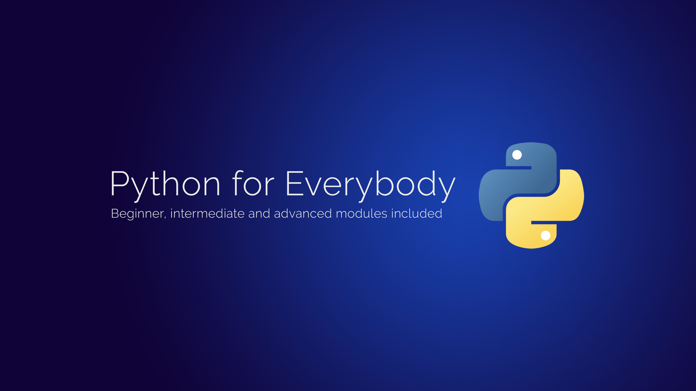

### Welcome to Python for Everybody

> Python for Everybody is a course by [@KalobTaulien](https://twitter.com/KalobTaulien) that teaches Python to beginner programmers, and helps intermediate and advanced developers level up their existing Python skills. This course uses Python 3.7 and newer. There is no support for Python 2 in this course.

### Where to get it:
Python for Everybody is available on:
- [x] [Skillshare](https://skl.sh/3a895Pn)
- [x] [Udemy](https://www.udemy.com/course/python-for-everybody-the-ultimate-modern-python-bootcamp/)
- [ ] pythonforeverybody.com (coming soon)

### Who is this course for?

The course is split into 3 major modules: beginners, intermediate, and advanced. If you're brand new to Python this will take you through the entire Python learning journey.

- [x] Beginner Python programmers
- [x] Intermediate Python programmers
- [x] Advanced Python programmers

### What's in this course?

A lot. There is _a lot_ in this course. Unless you're an expert Python programmer already, there's guaranteed to be something for you in this course. Below is an outline of the modules and the lessons involved in each module.

#### Introduction Module
- Python 2 vs. Python 3
- Where is Python used?
- Installing Python (Windows, MacOS and Linux)
- Command line crash course
- Using the interactive notebooks (Windows, MacOS and Linux)
- Where to download the code (This repo is where all the code lives!)
- How to ask great questions (well formed questions means great answers!)

#### Beginners Module
- Basic arithmetic
- Variables
- Formatting code in Python
- Data Types
- Mutable vs. Immutable
- Numbers
- Sequences (Strings and Lists)
- String properties and methods
- user input
- Print formatting
- Lists
- Dictionaries
- Tuples
- Sets
- Booleans
- NoneType
- Files
- **Finish off this module by creating your first small Python program**

#### Intermediate Module
- Comparison operators
- Comparison shortcuts
- Multiple comparison operators
- Chaining operators together
- Introduction to loops
- For loops
- Looping through dictionaries
- While loops
- Break and continue
- Type casting
- Helpful operators
- List comprehensions
- Dictionary comprehensions
- Functions
- Args and Kwargs
- Comments
- Map
- Filter
- Lambda expressions
- Scope

#### Advanced Module
- Welcome to OOP
- Creating your first class
- Class attributes
- Class methods
- Real life OOP example
- Class inheritance
- Class interfaces
- The super function
- Dunder (magic) methods
- Introduction to packages
- Installing 3rd party packages
- Finding 3rd party packages
- Seeing your installed 3rd party packages
- Introduction to modules
- Creating a package
- Name and main
- Errors and exceptions
- Catching exceptions
- Unit testing
- Nested functions
- Decorators
- Generators
- Linting
- Virtual environments
- Requirement files
- Interactive Python
- Multiple Python versions
- Local servers

#### Capstone Project
You will create an object detection application.

By using classes, functions, loops and 3rd party packages in a virtual environment you'll be able to take a photograph and find cars, people, bikes, cats and many many more common objects. We'll do this all in Python as your capstone project.
